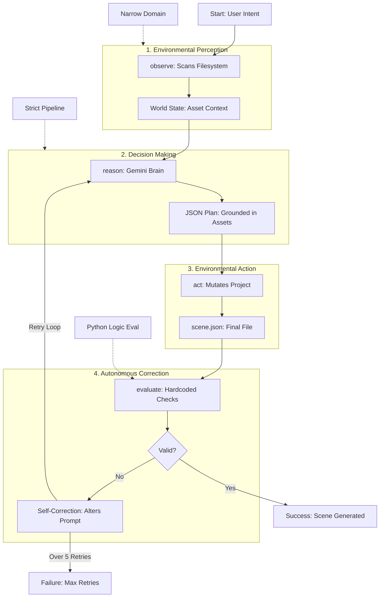

# VercelHackDeepMind

Cross-platform XR pipeline that takes natural language prompts, generates structured scene data via a Gemini-powered autonomous agent, and renders 3D characters and 360° environments in both visionOS (RealityKit) and WebXR (A-Frame).

## Agent Architecture

The Gemini scene agent uses an **observe/reason/act/evaluate** loop — this is what makes it an agent, not just an API call.



**Why this is an agent:** It perceives its environment (disk scan), reasons with an LLM (Gemini), takes actions (writes files), and self-corrects (retry loop with prompt adjustment). The domain is narrow and the pipeline is strict — but the loop is autonomous.

## How It Works

```
English prompt
  → agents/generate_scene.sh
  → Gemini agent (observe/reason/act/evaluate loop)
  → output/scene.json
  → SceneLoader.swift (visionOS) or A-Frame (web)
  → 3D scene with placed characters + 360° background
```

### Quick Start

The easiest way to test the pipeline is using the universal entry point at the root of the project.

```bash
# 1. Run the entry point — it will auto-setup Python, install requirements, and ask for your API key if missing
./run.sh "Place a surfer witch at position 0,1,-3"
# → Sets up environment -> Runs Agent -> Outputs to Xcode bundle + webXR/index.html

# 2. Add a 360° background to the scene
./run.sh --backgroundcreate "Ocean scene with a surfer witch"

# 3. See the full agent reasoning trace
./run.sh --verbose "Place a punk girl and a witch"
```

If you prefer to run the scripts manually:

```bash
# 1. Set up Python environment
python3 -m venv .venv && source .venv/bin/activate
pip install -r requirements.txt

# 2. Add your Gemini API key
echo "GEMINI_API_KEY=your-key-here" > .env

# 3a. Generate a scene from a prompt (outputs to both Xcode + WebXR)
./agents/generate_scene.sh "Place a surfer witch at position 0,1,-3"

# 3b. Generate a scene with ALL models (no prompt needed, no API key needed)
./agents/generate_all.sh
# → Scans assets/models/, places every model in the scene
# → Outputs to Xcode bundle + webXR/index.html

# 3c. Generate a scene for WebXR only
./agents/generate_webxr_scene.sh "Place a punk girl at 0,1,-3"
# → webXR/index.html + webXR/*.glb
# → Open webXR/index.html in any browser
```

### Agent CLI flags

```bash
# See the full agent trace
./agents/generate_scene.sh --verbose "Place a punk girl"

# Multiple characters
./agents/generate_scene.sh "Place a bruja and a punk girl in the scene"

# With 360° background
./agents/generate_scene.sh --backgroundcreate "Ocean scene with a surfer witch"

# Dry run (no files written)
./agents/generate_scene.sh --dry-run --verbose "Test prompt"

# Fresh scene (ignore existing scene.json)
./agents/generate_scene.sh --clean "Start over with a punk girl"
```

### Two output targets

The same Gemini agent powers both platforms. The difference is the generator layer:

**Both platforms at once:** `generate_scene.sh` runs the agent, copies `scene.json` into the Xcode bundle, then also runs the WebXR pipeline (resolve assets + generate A-Frame HTML).

**All models at once:** `generate_all.sh` scans `assets/models/` for every model directory, builds a scene.json with all of them spaced out, and generates output for both Xcode and WebXR. No prompt or API key needed.

**visionOS (RealityKit):** At runtime, `SceneLoader.swift` decodes the `characters` array from `scene.json`, loads `.usdz` models by logical name, and places them at the positions specified in the JSON (matching the A-Frame output exactly). Missing models show as purple placeholder spheres.

**WebXR (A-Frame):** The pipeline pipes scene JSON through `generators/generate_aframe.py`, which outputs a complete `webXR/index.html` with:
- `<a-sky>` — immersive sphere world (360° panorama or solid color)
- `<a-gltf-model>` — `.glb` 3D models at the positions from the JSON
- Camera rig with look-controls and WASD movement
- `.glb` files copied into `webXR/` so the browser can load them

```
webXR/
├── index.html      # Generated A-Frame scene
├── punkgirl.glb    # Copied from assets/models/punkgirl/
└── punk_house.png  # 360° background (if --backgroundcreate)
```

Open `webXR/index.html` in any browser — no server needed for local testing.

## Directory Structure

```
VercelDeepmindHack/    # visionOS / RealityKit app (Swift)
webXR/                 # WebXR / A-Frame (HTML/JS)
agents/                # Gemini agent + shell wrappers
  ├── gemini_agent.py  # Autonomous agent (observe/reason/act/evaluate)
  ├── gemini_agent_skill.py  # Archived single-shot version
  ├── generate_scene.sh      # Prompt → both platforms (Xcode + WebXR)
  ├── generate_all.sh        # All models → both platforms (no prompt needed)
  └── generate_webxr_scene.sh  # WebXR-only pipeline wrapper
assets/                # Shared 3D models, images, backgrounds
  ├── models/          # 3D models by logical name (bruja/, punkgirl/)
  ├── backgrounds/     # 360° equirectangular panoramas
  └── images/          # 2D art and panorama sources
generators/            # Asset resolution + A-Frame generation
  ├── resolve_assets.py   # Logical name → platform file path
  ├── generate_aframe.py  # JSON → A-Frame HTML
  └── asset_map.json      # Asset mapping table
output/                # Generated scene artifacts
docs/                  # Plans and project history
```

## Architecture

### RealityKit Pipeline (visionOS)

```
prompt → gemini_agent.py → output/scene.json (characters array)
       → cp to Xcode bundle
       → SceneLoader.swift decodes SceneDescription.characters
       → loads .usdz models, places at JSON positions
       → RealityKit entities → Vision Pro
```

### WebXR Pipeline (A-Frame)

```
prompt → gemini_agent.py → output/scene.json
       → resolve_assets.py (webxr) → scene_resolved.json
       → generate_aframe.py → webXR/index.html
       → .glb + background assets copied to webXR/
       → open in any browser
```

### Core Modules

- **Agents** (`/agents`) — Gemini-powered autonomous agent with retry loop
- **Generators** (`/generators`) — Asset resolution (`resolve_assets.py`) + A-Frame HTML generation (`generate_aframe.py`)
- **Parsers** (`/parsers`) — A-Frame HTML → JSON
- **Assets** (`/assets`) — Shared 3D models, 360° backgrounds, asset naming

### AI Layer

The Gemini agent scans the filesystem for available assets, calls Gemini with that context, validates the result, and retries if needed. Output format:

```json
{
  "characters": [
    { "type": "surfer witch", "asset": "bruja", "position": [0, 1, -3] },
    { "type": "punk girl", "asset": "punkgirl", "position": [2, 0, -5] }
  ],
  "background": {
    "type": "360_sphere",
    "asset": "punk_house",
    "description": "Mexican punk surf house interior",
    "exists": true
  }
}
```

The runtime layer resolves logical asset names (`"bruja"`) to platform-specific files (`.usdz` for RealityKit, `.glb` for WebXR).

## Asset Strategy

Assets use **logical names** mapped per platform:

| Logical Name | RealityKit | WebXR |
|---|---|---|
| `bruja` | `bruja_model.usdz` | `*.glb` |
| `punkgirl` | `punkgirl.usdz` | `punk_girl.glb` |

See [`assets/HOW-TO.md`](assets/HOW-TO.md) for details on adding new assets and 360° backgrounds.

## Requirements

- Python 3.x + `google-genai`, `python-dotenv`
- Google Gemini API key
- Xcode with visionOS SDK (for RealityKit output)
