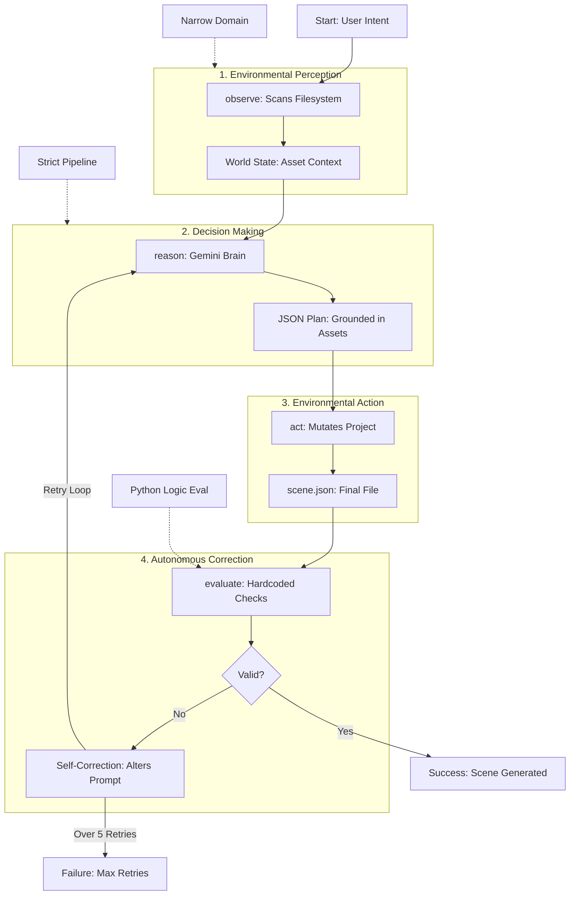

# Assets — How-To Guide

## Directory Structure

```
assets/
├── images/
│   └── bruja_cutout.png                  # 2D character art
├── models/
│   ├── bruja/
│   │   ├── bruja_model.usdz              # RealityKit (detailed, 21.9MB) — primary model
│   │   ├── blender/                      # Blender source + earlier exports
│   │   │   ├── *.blend, *.blend1         # Blender project files
│   │   │   ├── bruja.usdz               # Compact export (5.2MB)
│   │   │   ├── bruja2.usdz              # Alternate export (21.9MB)
│   │   │   └── *.glb                    # WebXR glTF binary (8.3MB)
│   │   └── old/                          # Archived versions
│   └── punkgirl/
│       ├── punkGirl.usdz                 # RealityKit model
│       ├── blender/                      # Blender source + exports
│       └── glb/punk_girl.glb             # WebXR glTF binary
├── backgrounds/                          # 360° equirectangular images for sphere environments
├── mov/                                  # Video assets
└── HOW-TO.md                             # This file
```

## Asset Naming Convention

Assets use **logical names** that map to platform-specific files:

| Logical Name | RealityKit File | WebXR File |
|---|---|---|
| `bruja` | `models/bruja/bruja_model.usdz` | `models/bruja/blender/*.glb` |
| `punkgirl` | `models/punkgirl/punkGirl.usdz` | `models/punkgirl/glb/punk_girl.glb` |

The Gemini agent scans `assets/models/` at runtime to discover available assets. The generator layer resolves logical names to platform-specific files via `generators/asset_map.json`.

## How the Gemini Agent Uses Assets

The agent uses an **observe/reason/act/evaluate** loop:

1. **Observe** — scans `assets/models/` and `assets/backgrounds/` to discover what's available on disk
2. **Reason** — calls Gemini with the prompt and the list of available assets
3. **Act** — validates asset names, swaps missing ones to fallbacks, writes `scene.json`
4. **Evaluate** — checks if the scene is valid; retries if not

### Basic usage

The simplest way to use the pipeline is via the universal `run.sh` entry point at the project root:

```bash
# Hackathon Entry Point — sets up venv, asks for API key, and outputs to both platforms
./run.sh "Place a punk girl at position 0,1,-3"
./run.sh --backgroundcreate "Ocean scene with a surfer witch"
./run.sh --verbose "Place three characters"
```

You can also use the underlying agent scripts directly:

```bash
# All models at once — no prompt or API key needed
./agents/generate_all.sh
# → Scans assets/models/, builds scene with every model, outputs to Xcode + WebXR

# Single character (outputs to both Xcode + WebXR)
./agents/generate_scene.sh "Place a punk girl at position 0,1,-3"

# Multiple characters
./agents/generate_scene.sh "Place a bruja and a punk girl in the scene"

# With 360° background
./agents/generate_scene.sh --backgroundcreate "Ocean scene with a surfer witch"

# See the full agent trace
./agents/generate_scene.sh --verbose "Place three characters"

# Dry run (no files written)
./agents/generate_scene.sh --dry-run --verbose "Test prompt"
```

### Output JSON format (multi-character)

```json
{
  "characters": [
    {
      "type": "surfer witch",
      "asset": "bruja",
      "position": [0, 1, -3]
    },
    {
      "type": "punk girl",
      "asset": "punkgirl",
      "position": [2, 0, -5]
    }
  ],
  "background": {
    "type": "360_sphere",
    "asset": "ocean_sunset",
    "description": "A warm ocean sunset with gentle waves",
    "exists": false
  }
}
```

## Adding New Assets

1. Create a folder under `assets/models/` with the logical name:
   ```
   assets/models/dragon/
   ```

2. Add platform-specific files:
   - `.usdz` for RealityKit / visionOS
   - `.glb` for WebXR / A-Frame

3. Add an entry to `generators/asset_map.json`

4. The agent automatically discovers new assets by scanning `assets/models/` — no code changes needed. Running `./agents/generate_all.sh` will automatically include the new model.

5. For RealityKit: copy the `.usdz` into `VercelDeepmindHack/VercelDeepmindHack/` so it's in the Xcode bundle

## Adding 360° Backgrounds

360° equirectangular panoramas wrap around the viewer as a sphere, creating an immersive environment. The image is a 2:1 ratio rectangle that maps onto the inside of a sphere.

### Walkthrough: Using an existing panorama

We have an example panorama at `assets/images/360/Mexican Punk House Surf_pano.png` — a black-and-white Mexican punk surf house interior. Here's how to use it:

**Step 1: Copy the panorama into `assets/backgrounds/`**

The agent scans `assets/backgrounds/` for available backgrounds. Copy your image there with a simple logical name:

```bash
cp "assets/images/360/Mexican Punk House Surf_pano.png" assets/backgrounds/punk_house.png
```

**Step 2: Verify the agent discovers it**

```bash
python agents/gemini_agent.py --verbose --dry-run "Place a punk girl in the scene"
```

In the `OBSERVE` output you should see:
```
🔍 OBSERVE — ...
   Backgrounds: ['punk_house.png']
```

**Step 3: Generate a scene with the background**

```bash
python agents/gemini_agent.py --backgroundcreate --verbose \
  "Place a punk girl in a Mexican punk surf house"
```

The agent will tell Gemini about the available background (`punk_house.png`) and Gemini will include it in the scene JSON:
```json
{
  "characters": [...],
  "background": {
    "type": "360_sphere",
    "asset": "punk_house",
    "description": "Mexican punk surf house interior",
    "exists": true
  }
}
```

**Step 4: Use in A-Frame (WebXR)**

The A-Frame generator places the panorama as an `<a-sky>` element that surrounds the viewer:
```html
<a-sky src="punk_house.png"></a-sky>
```

To test it quickly, create a minimal HTML file:
```html
<!DOCTYPE html>
<html>
<head>
  <script src="https://aframe.io/releases/1.7.0/aframe.min.js"></script>
</head>
<body>
  <a-scene>
    <a-sky src="punk_house.png"></a-sky>
  </a-scene>
</body>
</html>
```

Copy both the HTML and the `.png` into the same folder, then open in a browser. You'll be inside the punk house.

**Step 5: Use in RealityKit (visionOS)**

For RealityKit, the panorama needs to be loaded as a skybox texture on an `ImmersiveSpace`. Copy the image into the Xcode bundle:
```bash
cp assets/backgrounds/punk_house.png VercelDeepmindHack/VercelDeepmindHack/
```

### Creating your own 360° panoramas

You can create equirectangular panoramas using:

| Tool | How |
|---|---|
| **AI generators** (Midjourney, DALL-E, Stable Diffusion) | Use the prompt suffix `--style equirectangular panorama 360` or `equirectangular projection`. Set aspect ratio to 2:1 |
| **Skybox AI** (skybox.blockadelabs.com) | Free web tool — generates 360° environments from text prompts, exports as equirectangular `.jpg` |
| **Blender** | Render with a panoramic camera set to "Equirectangular" projection |
| **iPhone/Android** | Use the built-in panorama camera mode (not true equirectangular but works for `<a-sky>`) |
| **Ricoh Theta / Insta360** | Dedicated 360° cameras that output equirectangular images directly |

**Tips for good panoramas:**
- Use **2:1 aspect ratio** (e.g., 4096x2048, 8192x4096)
- `.jpg` is fine for most cases — smaller file size than `.png`
- For HDR lighting in RealityKit, use `.hdr` or `.exr` format
- Test in A-Frame first — it's the fastest way to preview (`<a-sky src="your_image.jpg">`)

### Where backgrounds live

| Location | Purpose |
|---|---|
| `assets/images/360/` | Source/original panorama files |
| `assets/backgrounds/` | Agent-discoverable backgrounds (copy here with simple names) |
| `webXR/` | Copied here by the generator for browser loading |
| `VercelDeepmindHack/VercelDeepmindHack/` | Copied here for Xcode bundle |

### Supported formats

`.jpg`, `.jpeg`, `.png`, `.hdr`, `.exr`

## Asset Sources

- **Meshy AI** — used for the bruja/surfing siren 3D models (generates .glb, can export .usdz)
- **Reality Converter** (macOS) — convert .glb to .usdz locally
- **Blender** — .blend source files available for the bruja and punkgirl models

## Quick Reference: File Formats

| Format | Platform | Notes |
|---|---|---|
| `.usdz` | visionOS / RealityKit | Apple's 3D format, used in Swift code |
| `.glb` | WebXR / A-Frame | glTF binary, loads in browser |
| `.blend` | Blender | Source files, not used at runtime |
| `.png` | Both | 2D textures and cutouts |
| `.jpg`/`.hdr` | Both | 360° background images |


## End-to-End Pipeline

### RealityKit pipeline
```
English prompt
  → agents/generate_scene.sh
  → agents/gemini_agent.py (observe/reason/act/evaluate loop)
  → output/scene.json (characters array with positions)
  → cp to Xcode bundle
  → SceneLoader.swift decodes SceneDescription.characters array
  → loads .usdz by logical name, places at JSON positions
  → RealityKit entities (Vision Pro)
```

> **Note:** `SceneLoader.swift` decodes the same `characters` array format used by the WebXR pipeline. Positions in both platforms are identical — e.g. bruja at `[0, 0.5, -3]`, punkgirl at `[3, 0.5, -3]`.

### WebXR pipeline (A-Frame)

```
English prompt
  → agents/generate_webxr_scene.sh
  → agents/gemini_agent.py (observe/reason/act/evaluate loop)
  → output/scene.json
  → generators/resolve_assets.py webxr  (logical name → .glb path)
  → output/scene_resolved.json
  → generators/generate_aframe.py       (JSON → HTML)
  → webXR/index.html + webXR/*.glb + webXR/*.png
```

**What `generate_webxr_scene.sh` does step by step:**

1. Runs `gemini_agent.py` with your prompt → writes `output/scene.json`
2. Runs `resolve_assets.py webxr` → adds `resolved_asset` field with the `.glb` path
3. Runs `generate_aframe.py` → generates `webXR/index.html` and copies `.glb` files into `webXR/`

**What the generated A-Frame HTML contains:**

- `<a-sky>` — immersive sphere world (360° panorama image or solid color background)
- `<a-gltf-model>` — one per character, loading the `.glb` at the position from the JSON
- `<a-entity light>` — ambient + directional lighting
- `<a-camera>` — camera rig with `look-controls` and `wasd-controls` for navigation
- `<a-assets>` — preloads all models and textures

**Example output directory:**

```
webXR/
├── index.html      # Generated A-Frame scene (open in browser)
├── punkgirl.glb    # Copied from assets/models/punkgirl/glb/
├── bruja.glb       # Copied from assets/models/bruja/blender/
└── punk_house.png  # 360° background (if --backgroundcreate was used)
```

**Quick test:**

```bash
# Generate a WebXR scene
./agents/generate_webxr_scene.sh "Place a punk girl at 0,1,-3"

# Open in browser (no server needed for local files)
open webXR/index.html

# Or serve locally for full WebXR/VR headset support
cd webXR && python3 -m http.server 8000
# → visit http://localhost:8000 in browser or VR headset
```

**With a 360° background:**

```bash
# Make sure a panorama is in assets/backgrounds/
cp "assets/images/360/Mexican Punk House Surf_pano.png" assets/backgrounds/punk_house.png

# Generate with background
./agents/generate_webxr_scene.sh --backgroundcreate "Punk girl in the surf house"

# The generated HTML will include:
# <a-sky src="punk_house.png"></a-sky>
# and punk_house.png will be copied into webXR/
```

### Asset resolution + fallback behavior
- The agent checks each asset name against what's on disk
- If an asset is missing, it swaps to the fallback (`bruja`) and logs the swap
- If even the fallback is missing, the character is skipped
- At runtime (RealityKit), `SceneLoader.swift` decodes the `characters` array, loads each `.usdz` by logical name, and places it at the position from the JSON. If a `.usdz` is missing, a **purple placeholder sphere** is shown
- For WebXR, if a `.glb` is missing, the `<a-gltf-model>` will simply not render

### Key Insight
The Gemini agent validates assets before writing `scene.json`. It won't reference assets that don't exist on disk (it falls back or skips). The generator/runtime layer then maps logical names to actual files.


# Addendum

## Flow Diagram

