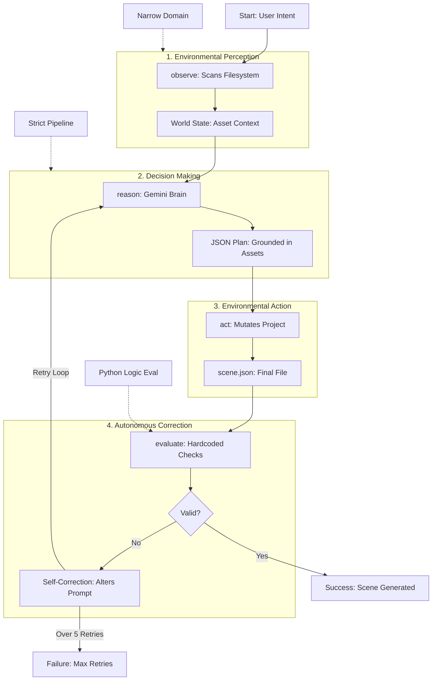

# Gemini Scene Agent — Implementation Plan

> **Purpose:** This is the plan document for Claude Code / Cline to follow.
> It converts `gemini_agent.py` from a single-shot skill into an autonomous
> agent with asset validation, multi-character support, and 360° background
> generation.
>
> **Rule:** Complete each phase fully. Check every done-when item before
> moving to the next phase. Do not skip ahead.

---

## Context

### What exists now (the "skill" version)

`agents/gemini_agent.py` is a single-shot script:
- Takes a prompt → calls Gemini → returns JSON → stops
- No validation of whether assets exist on disk
- No looping, no retry, no multi-character handling
- Output: a single `scene.json` with one character entry

### What we're building (the "agent" version)

An autonomous loop that:
1. **Observes** — scans disk for available `.usdz`/`.glb` assets and existing `scene.json`
2. **Reasons** — calls Gemini to interpret the prompt (supports multiple characters)
3. **Acts** — validates assets, swaps missing ones to fallbacks, writes `scene.json`
4. **Evaluates** — checks if scene is complete and valid; if not, adjusts and loops

Plus a new capability:
5. **360° background creation** — detects or generates equirectangular sphere images that place the user inside the scene (A-Frame `<a-sky>` / RealityKit skybox)

### Architecture after implementation

```
prompt + flags
  → agent loop (observe/reason/act/evaluate)
    → Gemini API (reason step)
    → disk scan (observe step)
    → asset resolution + fallback (act step)
    → validation + retry (evaluate step)
  → scene.json (characters + optional background)
  → renderer (RealityKit / A-Frame)
```

### Key files

| File | Role |
|---|---|
| `agents/gemini_agent.py` | Main agent script (will be rewritten) |
| `agents/gemini_agent_skill.py` | Backup of old single-shot version |
| `agents/generate_scene.sh` | Shell wrapper (will be updated) |
| `CLAUDE.md` | Project rules for Claude Code |
| `docs/history/history.md` | Project history log |

### Key paths

| Path | Contains |
|---|---|
| `assets/models/` | Subdirectories per model (e.g., `bruja/`) with `.usdz`, `.glb`, `.blend` |
| `assets/backgrounds/` | 360° equirectangular images (`.jpg`, `.png`, `.hdr`) |
| `VercelDeepmindHack/VercelDeepmindHack/` | Xcode resources — `.usdz` files and `scene.json` |
| `webXR/` | A-Frame HTML files |

---

## Phase 0: Preserve the Skill Version

**What to do:**
1. Copy `agents/gemini_agent.py` → `agents/gemini_agent_skill.py`
2. Add a comment at the top of the skill version: `# ARCHIVED: single-shot skill version. See gemini_agent.py for the agent version.`
3. Do NOT modify the skill version after this

**Done when:**
- [ ] `agents/gemini_agent_skill.py` exists and is identical to the current `gemini_agent.py`
- [ ] Running `python agents/gemini_agent_skill.py "test"` still works
- [ ] `agents/gemini_agent.py` is untouched (not yet modified)

---

## Phase 1: Agent Loop Structure

Rewrite `agents/gemini_agent.py` with the observe/reason/act/evaluate loop.

**What to do:**

1. Replace `gemini_agent.py` with the agent version that has:
    - `observe()` function — returns state dict
    - `reason()` function — calls Gemini, returns list of characters
    - `act()` function — resolves assets, writes scene.json, returns report
    - `evaluate()` function — validates report, returns (success, issues)
    - `run_agent()` function — the main `for` loop that calls all four

2. Add CLI flags via `argparse`:
    - Positional: `prompt` (the natural language input)
    - `--dry-run` — plan without writing files
    - `--max-loops N` — cap iterations (default: 5)
    - `--verbose` — show full observe/reason/act/evaluate trace
    - `--clean` — ignore existing scene.json, start fresh

3. Keep stdout output as clean JSON (verbose goes to stderr or is clearly separated)

**Key code pattern:**
```python
def run_agent(prompt, max_loops=5, dry_run=False, verbose=False):
    for loop_num in range(1, max_loops + 1):
        state = observe(verbose=verbose)
        characters = reason(prompt, state, verbose=verbose)
        report = act(characters, state, dry_run=dry_run, verbose=verbose)
        success, issues = evaluate(report, verbose=verbose)
        if success:
            break
        # Adjust prompt for retry
        prompt = f"Fix: {'; '.join(issues)}. Original: {prompt}"
    return report
```

### Agent diagram



**Done when:**
- [ ] `python agents/gemini_agent.py "Place a witch" --verbose` shows all 4 phases
- [ ] `python agents/gemini_agent.py "Place a witch" --dry-run` produces no file writes
- [ ] `python agents/gemini_agent.py "Place a witch"` outputs clean JSON to stdout
- [ ] `--max-loops 1` caps at exactly 1 iteration
- [ ] Agent stops after success (doesn't loop unnecessarily)
- [ ] Old `python agents/gemini_agent_skill.py "test"` still works independently

---

## Phase 2: Asset Observation

The agent's **observe** step scans the filesystem for available assets.

**What to do:**

1. In `observe()`, scan these locations:
    - `assets/models/` — each subdirectory is a model name, check for `.usdz`, `.glb`, `.blend`, `.obj`, `.fbx`
    - `VercelDeepmindHack/VercelDeepmindHack/` — check for `.usdz` files (some are copied here directly)
    - `assets/backgrounds/` — check for 360° images (`.jpg`, `.png`, `.hdr`) — needed for Phase 5

2. Build a state dict:
   ```python
   {
       "available_assets": {
           "bruja": [".usdz", ".glb"],
           "witch": [".usdz"]
       },
       "available_backgrounds": ["ocean_360.jpg", "forest_360.hdr"],
       "existing_scene": { ... } or None
   }
   ```

3. Use `pathlib.Path` for all filesystem operations (no `os.path` / `glob` mixing)

4. Handle gracefully: missing directories, empty directories, permission errors

**Done when:**
- [ ] `--verbose` output includes a line like `Available assets: {"bruja": [".usdz", ".glb"]}`
- [ ] `--verbose` output includes `Available backgrounds: [...]` (even if empty list)
- [ ] Missing `assets/models/` directory does not crash — returns empty dict
- [ ] `.usdz` files in Xcode resources dir are detected
- [ ] State dict is passed to `reason()` and `act()` correctly

---

## Phase 3: Asset Resolution + Fallbacks

The agent's **act** step resolves logical asset names to real files and swaps missing ones.

**What to do:**

1. After Gemini returns characters, check each `asset` name against `state["available_assets"]`
2. If the asset exists → keep it
3. If the asset is missing → swap to `FALLBACK_ASSET` (default: `"bruja"`) and log the swap
4. If even the fallback is missing → log error, skip that character
5. Validate positions:
    - Must be a list of 3 numbers
    - Clamp to bounds: each value in `[-20, 20]`
    - Default position if invalid: `[0, 1, -3]`

**Done when:**
- [ ] `"Place a dragon at 0,0,-5"` → agent swaps `dragon` to `bruja` and logs it
- [ ] `--verbose` shows: `🔄 "dragon" → "bruja" (not found on disk)`
- [ ] Invalid position `[999, NaN, -5]` gets clamped/defaulted
- [ ] If no assets exist at all, agent logs error and returns empty scene (no crash)
- [ ] Fallback asset name is configurable at the top of the file

---

## Phase 4: Multi-Character Support

Handle prompts like "Place a witch, a dragon, and a surfer in the scene."

**What to do:**

1. Update the Gemini system prompt to request a `characters` array:
   ```json
   {
     "characters": [
       { "type": "surfer witch", "asset": "bruja", "position": [0, 1, -3] },
       { "type": "dragon", "asset": "character", "position": [2, 0, -5] }
     ]
   }
   ```

2. Handle backward compatibility — if Gemini returns old format `{ "character": {...} }`, wrap it into the array format

3. In the **evaluate** step, check for:
    - Duplicate positions (characters stacked on each other) → warning
    - Missing characters (prompt said 3 but Gemini returned 2) → retry with adjusted prompt
    - All assets resolved

4. In the **act** step, support merging with existing `scene.json`:
    - Default: append new characters to existing list
    - `--clean` flag: overwrite (start with empty character list)

**Done when:**
- [ ] `"Place three characters in a row"` returns 3 entries in scene.json
- [ ] Old single-character Gemini responses still parse correctly
- [ ] Duplicate positions trigger a warning in `--verbose` output
- [ ] Running the agent twice without `--clean` → characters accumulate
- [ ] Running with `--clean` → only new characters in scene.json
- [ ] Merged scene.json is valid JSON

---

## Phase 5: 360° Background Support (`--backgroundcreate`)

Add the ability to check for or generate 360° equirectangular images that create a sphere environment the user is placed inside of.

**What to do:**

1. Add CLI flag: `--backgroundcreate`
    - When present, the agent also handles the background/environment sphere
    - Without the flag, background is left untouched

2. Update the Gemini system prompt to optionally include background:
   ```json
   {
     "characters": [...],
     "background": {
       "type": "360_sphere",
       "asset": "ocean_sunset",
       "description": "A warm ocean sunset with gentle waves"
     }
   }
   ```
   Only request this when `--backgroundcreate` is passed.

3. In **observe**, scan `assets/backgrounds/` for existing 360° images:
    - Supported formats: `.jpg`, `.png`, `.hdr`, `.exr`
    - Build list: `state["available_backgrounds"]`

4. In **act**, resolve the background:
    - If Gemini returns a background asset name that matches an existing file → use it
    - If no match → log that a 360° image needs to be created (the agent flags it, doesn't generate the image itself — image generation is a separate skill)
    - Write the background entry into scene.json:
      ```json
      {
        "characters": [...],
        "background": {
          "type": "360_sphere",
          "asset": "ocean_sunset.jpg",
          "exists": true
        }
      }
      ```

5. In **evaluate**, check:
    - If `--backgroundcreate` was requested, does scene.json have a `background` entry?
    - Does the referenced background file exist on disk?
    - If not → flag as issue (but don't block character placement)

6. Platform mapping for backgrounds:
    - **A-Frame (WebXR):** `<a-sky src="ocean_sunset.jpg"></a-sky>` — sphere that surrounds the user
    - **RealityKit:** Skybox texture on an `ImmersiveSpace`
    - The agent writes the logical name; the generator layer maps to platform-specific code

**Done when:**
- [ ] `python agents/gemini_agent.py "Beach scene with a witch" --backgroundcreate --verbose` includes background in output
- [ ] Without `--backgroundcreate`, no background entry in scene.json
- [ ] Existing 360° images in `assets/backgrounds/` are detected by observe
- [ ] Missing background image is flagged but doesn't block character placement
- [ ] scene.json includes `"background"` with `"exists": true/false`
- [ ] `--verbose` shows: `🌐 Background: ocean_sunset.jpg (found on disk)` or `⚠️ Background: ocean_sunset.jpg (not found — needs creation)`

---

## Phase 6: Shell Script Update

Update `agents/generate_scene.sh` to pass flags through to the agent.

**What to do:**

1. Support all agent flags:
   ```bash
   ./agents/generate_scene.sh "prompt"                        # basic (backward compat)
   ./agents/generate_scene.sh --verbose "prompt"              # show agent trace
   ./agents/generate_scene.sh --clean "prompt"                # fresh scene
   ./agents/generate_scene.sh --backgroundcreate "prompt"     # include 360° background
   ./agents/generate_scene.sh --dry-run --verbose "prompt"    # plan only
   ```

2. Keep backward compatibility — bare `./agents/generate_scene.sh "prompt"` still works exactly as before

3. Continue copying output to Xcode resources path

**Done when:**
- [ ] All flag combinations pass through correctly
- [ ] Bare prompt with no flags works as before
- [ ] `scene.json` lands in `VercelDeepmindHack/VercelDeepmindHack/scene.json`
- [ ] Shell script exit codes: 0 on success, 1 on failure

---

## Phase 7: Demo Polish

Make the agent trace look impressive for the hackathon demo.

**What to do:**

1. Emoji prefixes for each phase:
    - 🔍 Observe
    - 🧠 Reason
    - ⚡ Act
    - 📋 Evaluate
    - 🌐 Background (when applicable)
    - 🔄 Retry
    - 🎉 Success

2. Add timing to `--verbose`:
   ```
   🧠 REASON (0.8s) — Gemini returned 3 character(s)
   ```

3. Summary line at the end:
   ```
   🎉 3 characters + background placed in 2 loops (2.1s)
   ```

4. Non-verbose mode stays clean — just JSON to stdout

**Done when:**
- [ ] `--verbose` output looks polished with emojis and timing
- [ ] Non-verbose output is raw JSON only (no decoration)
- [ ] Typical prompt completes in under 5 seconds
- [ ] Demo-ready: can run in a terminal during a presentation

---

## Prompt Template for Claude Code

Use this when handing a phase to Claude Code or Cline:

```
Read docs/plan/agent-implementation.md for the full plan.
Read CLAUDE.md for project rules.
Read docs/history/history.md for what's been done.

Current phase: [PHASE NUMBER]
Task: [SPECIFIC TASK FROM THE PHASE]

Rules:
- Only work on the current phase
- Check every done-when item before saying you're finished
- Do not modify files outside the current phase scope
- If you need to change something from a previous phase, ask first
- Use pathlib.Path, not os.path
- Keep the skill version (gemini_agent_skill.py) untouched
```

---

## Quick Reference: CLI Flags

| Flag | Phase | Description |
|---|---|---|
| `prompt` | 1 | Natural language scene description (positional) |
| `--verbose` | 1 | Show full agent trace (observe/reason/act/evaluate) |
| `--dry-run` | 1 | Plan without writing files |
| `--max-loops N` | 1 | Cap agent iterations (default: 5) |
| `--clean` | 4 | Ignore existing scene.json, start fresh |
| `--backgroundcreate` | 5 | Include 360° background sphere in scene |

## Quick Reference: scene.json Schema (Final)

```json
{
  "characters": [
    {
      "type": "surfer witch",
      "asset": "bruja",
      "position": [0, 1, -3],
      "_original_asset": "witch"
    }
  ],
  "background": {
    "type": "360_sphere",
    "asset": "ocean_sunset.jpg",
    "description": "A warm ocean sunset",
    "exists": true
  }
}
```

`_original_asset` only appears when a fallback swap happened.
`background` only appears when `--backgroundcreate` was used.